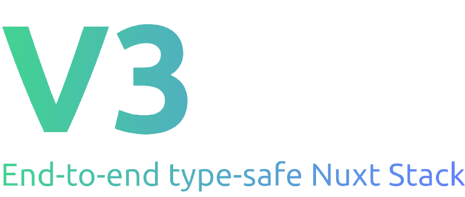

A Vue, TRPC & Prisma stack, inspired by the T3 Stack. V3 includes:

- Nuxt 3
- Tailwind
- Typescript
- TS-Pattern
- Prisma
- Zod
- TRPC
- Next-Auth


## Prerequisites

- node 18.X
- npm
- pnpm

pnpm is used for installing and updating packages.

## Installation & Getting Started

Installs dependencies & generate Prisma types

```pnpm i && pnpm run prisma:generate```

Generate your first migration:

```pnpm run prisma:migrate```

Seeds the DB

```pnpm run prisma:seed```

Now run the below command to start the sevrer:

```pnpm run dev```


Read the docs/GUIDE.md for more information.

